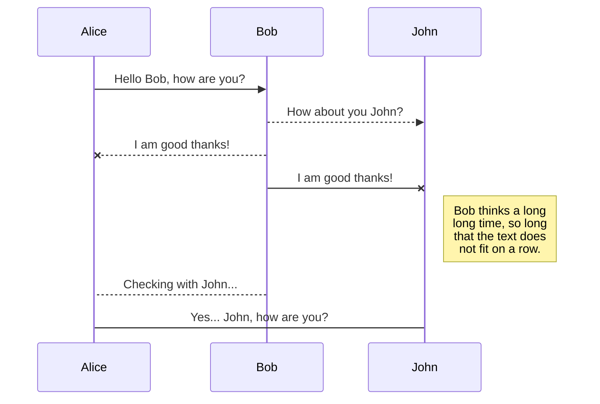
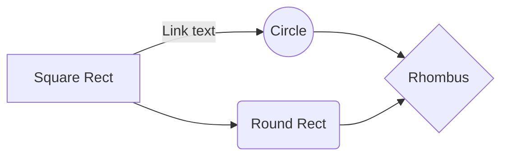

# Service Locator for Unity
___
A Service Locator, gives a flexible way to find and create high level objects fast and easily, 
making the project more loosely coupled, than traditional Unity solutions would let You do.

###The Problem, that we want to solve?
Take this example:
There are some differently typed objects, but all of them need to know the game time,
more specifically all of these objects needs an objects that provides the the same game time (or any other service).
But in Our software there are different situations where different objects provides this game time different ways.
For example testing, tutorials.

In the same time we want to writes or service classes or service user classes (clients) the way they don't even know each other,
not the less how can they find the other one.

What could we do?
- We could use public or [SerializeField] filed in our clients to manually wire in the server.
- We can do this reversed where the server knows the clients.
- We can fine the client objects with GameObject.Find(); or Resources.Load() one object.
- We can find services with FindObjectOfType<T>(), or clients with FindObjectsOfType<T>().
- We use singleton pattern.
- Others...

All of these approaches have at least one problem but mostly more from the following list:

1. **We can't rely on abstraction.** We expect for the client to know the exact type of the server.
   (Dependency inversion principle is broken)
2. **High level objects knows the low level ones.** (Dependency inversion principle broken)
3. **We only moved the complexity to the inspector.** Which is even worse in this situation because, some technical detail ended up where designer settings should be exposed it to the designers, who may not know anything about the software architecture.
4. **We made the architecture rigid.** Because if we change one service we manually need to change the reference everywhere.
5. **There server object always need to exist before it's needed.**
   (It would be nice if it would be automatically created if it's not exist when it's needed.)
6. **It's only works with Unity Components as clients or services.**
7. **It's only works in play time.**
8. **Need to rely on name**, Which makes our architecture extremely fragile.

Unfortunately there are no good solution to this problem available in Unity out of the box.

# Markdown extensions

StackEdit extends the standard Markdown syntax by adding extra **Markdown extensions**, providing you with some nice features.

> **ProTip:** You can disable any **Markdown extension** in the **File properties** dialog.

|Test|Test2|Test |
|-|-|-|
| Abraka |Dabra|

## SmartyPants

SmartyPants converts ASCII punctuation characters into "smart" typographic punctuation HTML entities. For example:

|                |ASCII                          |HTML                         |
|----------------|-------------------------------|-----------------------------|
|Single backticks|`'Isn't this fun?'`            |'Isn't this fun?'            |
|Quotes          |`"Isn't this fun?"`            |"Isn't this fun?"            |
|Dashes          |`-- is en-dash, --- is em-dash`|-- is en-dash, --- is em-dash|

## KaTeX

You can render LaTeX mathematical expressions using [KaTeX](https://khan.github.io/KaTeX/):

The *Gamma function* satisfying $\Gamma(n) = (n-1)!\quad\forall n\in\mathbb N$ is via the Euler integral

$$
\Gamma(z) = \int_0^\infty t^{z-1}e^{-t}dt\,.
$$

> You can find more information about **LaTeX** mathematical expressions [here](http://meta.math.stackexchange.com/questions/5020/mathjax-basic-tutorial-and-quick-reference).

## UML diagrams

You can render UML diagrams using [Mermaid](https://mermaidjs.github.io/). For example, this will produce a sequence diagram:

And this will produce a flow chart:

